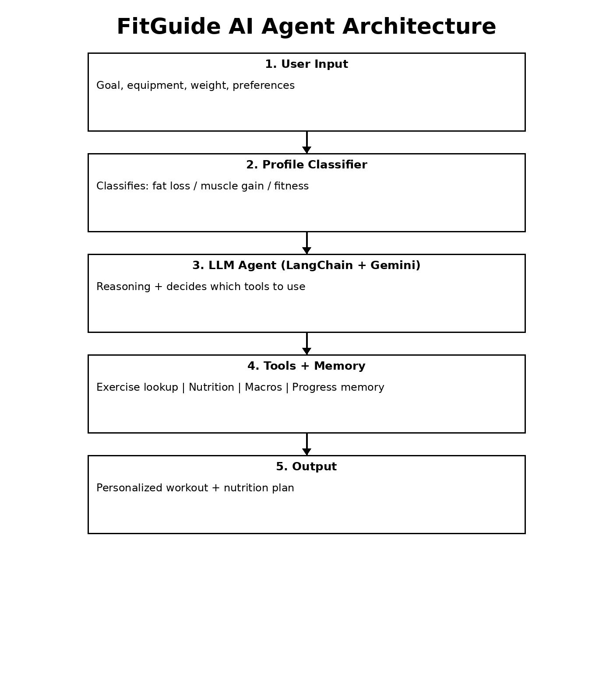

#  FitGuide: AI Fitness & Nutrition Coach

FitGuide is an AI-powered fitness and nutrition coaching application that provides personalized workout and nutrition plans using a combination of LLM reasoning, structured tools, and memory. The project evolved from a notebook-based agent into a full interactive web application using Streamlit.

---

##  Team Members

* Tien Manh Nguyen
* Oman Malek
* Lufei Yu
* Phillip Torres

---

##  Problem Statement

Many people want to improve their fitness, lose weight, or build muscle but struggle with where to start. Most online resources are:

* Generic
* Overwhelming
* Not personalized

FitGuide solves this by acting as a simple, interactive AI coach that:

* Understands user goals
* Suggests workouts based on available equipment
* Provides flexible nutrition guidance
* Tracks user progress and updates plans

Target users include beginners, students, and busy individuals.

---

##  Project Type

**Option A — Single AI Agent**

Originally built in a notebook, the project was expanded into a full **Streamlit web app** with:

* Structured tool-based reasoning
* Interactive UI
* Sidebar Q&A chatbot

---

##  Final Architecture

**User Input → Profile Classifier → Tools → LLM (Gemini) → Memory → Output UI**

### Components

* **Profile Classifier**

  * Determines goal type (fat loss, muscle gain, general fitness)
  * Maps user equipment to system-supported tools

* **Tools**

  * Exercise recommendation tool (filtered dataset)
  * Macro estimator (calories + protein)
  * Nutrition guidance system (multiple styles)
  * Memory tools (save & retrieve progress)

* **LLM (Gemini via LangChain)**

  * Generates structured plans
  * Handles reasoning and explanation

* **Memory**

  * Stores user progress within session
  * Enables updated plan generation

* **Streamlit UI**

  * Main plan generator
  * Progress tracking interface
  * Sidebar chatbot (Q&A assistant)

## 📊 Architecture Diagram

 

\



\

---

## 🚀 Key Improvements from Notebook

Compared to the original agent notebook :

* ✅ Converted into a **full web application (Streamlit)**
* ✅ Added **multiple difficulty levels** (Beginner, Intermediate, Advanced)
* ✅ Expanded **equipment support**:

  * Dumbbells
  * Resistance bands
  * Treadmill
  * Bike
  * Yoga mat
* ✅ Added **nutrition styles**:

  * Balanced
  * High protein
  * Low carb
  * Vegetarian
  * Budget-friendly
  * Meal prep
* ✅ Implemented **sidebar chatbot (Q&A assistant)**
* ✅ Improved **exercise filtering logic**
* ✅ Better **user experience and interface**

---

## 🛠️ Technologies Used

* Python
* Streamlit
* LangChain
* Google Gemini API
* Pandas
* Custom datasets (exercise + nutrition)

---

## ⚙️ How to Run

### 1. Create virtual environment

```bash
python3 -m venv .venv
source .venv/bin/activate
```

### 2. Install dependencies

```bash
pip install streamlit pandas langchain-google-genai
```

### 3. Run the app

```bash
streamlit run app.py
```

### 4. Open in browser

```
http://localhost:8501
```

## 🎥 Demo Video

Watch the demo here:

https://drive.google.com/file/d/1YRggDnCHGKB8tFJ76K8z_n3RDgRI1jEF/view?usp=sharing

This demo shows:
1. Generating a new plan
2. Saving progress to memory
3. Updating plan using memory
---

## 💬 Features

### Main App

* Generate personalized workout plans
* Choose goal, equipment, difficulty, and nutrition style
* View exercises + macros

### Memory System

* Save progress notes
* Generate updated plans using memory

### Sidebar Chatbot

* Ask quick fitness or nutrition questions
* Lightweight assistant for instant help

---

## ⚠️ Limitations

* Small exercise and nutrition dataset
* Memory is session-based (not persistent)
* No real-time API integration for nutrition data

---

## 🔮 Future Improvements

* Connect to real nutrition APIs (USDA)
* Add persistent database (user accounts)
* Mobile-friendly UI / deployment
* Add computer vision (food tracking or posture analysis)

---

## 📌 Conclusion

FitGuide successfully evolved from a notebook-based AI agent into a full interactive application. It demonstrates how LLMs can be combined with structured tools, memory, and UI design to create a practical and user-friendly AI system.
